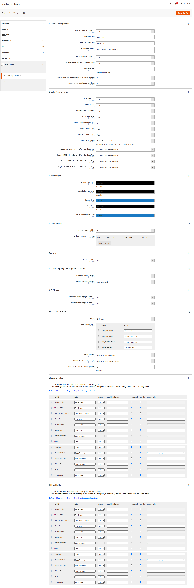
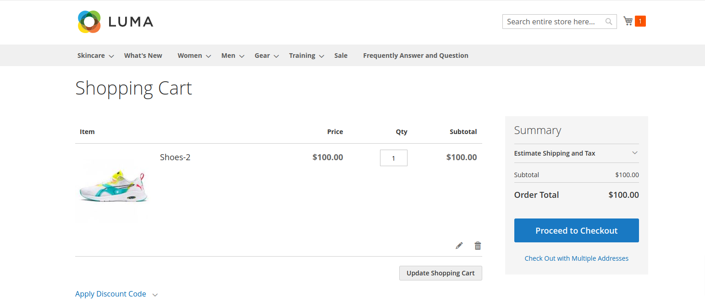
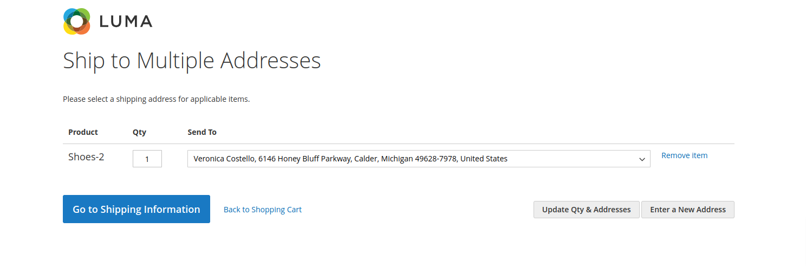
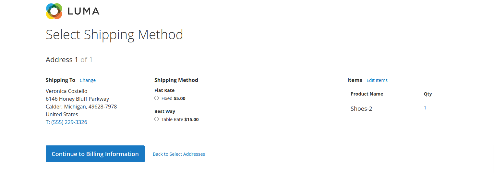
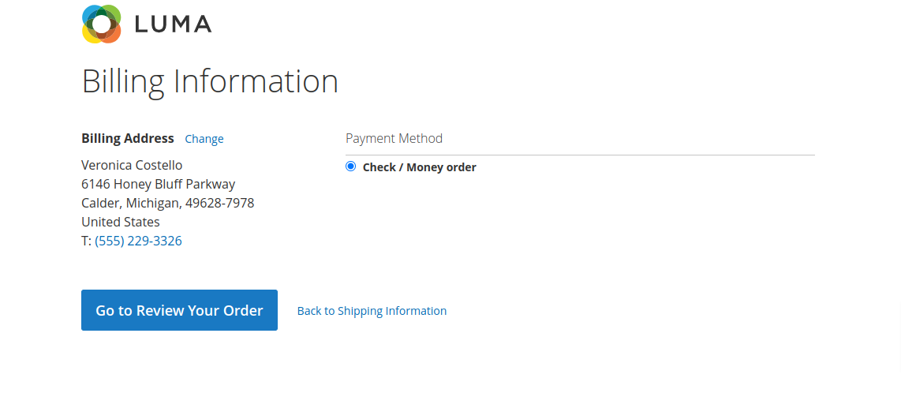
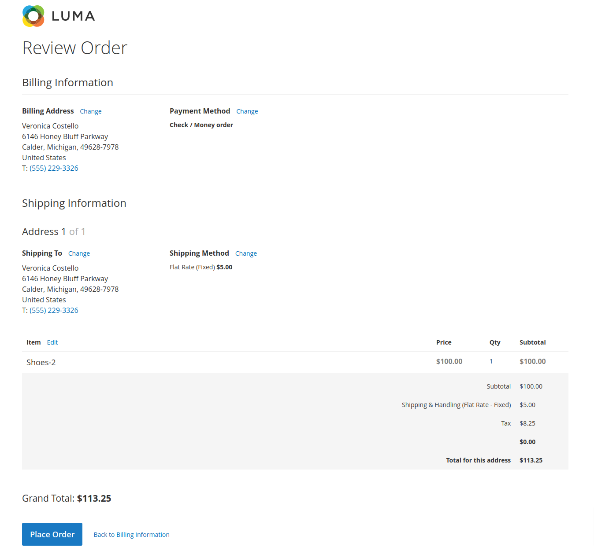
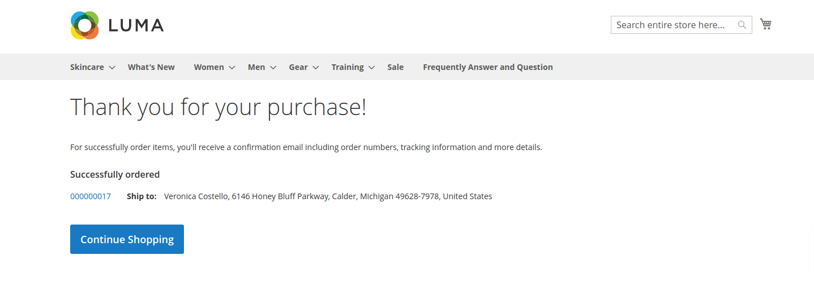

# Magento 2 One Step Checkout Extension

Enhance your Magento 2 store with a streamlined checkout process using our Magento 2 One Step Checkout Module. Simplify the checkout experience for your customers with a single-page checkout that consolidates all steps into one, improving conversion rates and customer satisfaction.

## Key Features:

- **Single-Page Checkout:**
All checkout steps are consolidated into one page for a smoother and faster checkout experience.
- **Customizable Layout:**
Easily customize the layout and design to match your store’s branding and user experience requirements.
- **One-Click Checkout:**
Allow customers to quickly complete their purchase with minimal clicks, reducing cart abandonment.
- **Responsive Design:**
Optimized for all devices, ensuring a seamless experience on desktop, tablet, and mobile.
- **Enhanced User Experience:**
Streamlined checkout process reduces friction and increases conversion rates.

## Benefits:

- **Increased Conversion Rates:**
Simplify the checkout process to reduce cart abandonment and boost sales.
- **Faster Checkout:**
Speed up the checkout process with a single-page layout, providing a more efficient shopping experience.
- **Improved Customer Satisfaction:**
Offer a modern, user-friendly checkout experience that aligns with customer expectations.
- **Customization Flexibility:**
Adapt the checkout page to meet your specific business needs and branding.

## Compatibility:
This extension is compatible with Magento 2.4.X (PHP - 8.1 - 8.3) version.

## Installation:
**Install via composer (recommend)** - 

Easy installation process with step-by-step instructions provided for hassle-free setup.
~~~~~~~~~~~~~~~~~~~~~
composer require mavenbird/module-onestepcheckout
php bin/magento setup:upgrade
php bin/magento setup:static-content:deploy
php bin/magento setup:di:compile
php bin/magento cache:flush
~~~~~~~~~~~~~~~~~~~~~

## Upgrade/Update Module:
Run the following command in Magento 2 root folder for easy update -
~~~~~~~~~~~~~~~~~~~~~
composer update mavenbird/module-onestepcheckout
php bin/magento setup:upgrade
php bin/magento setup:static-content:deploy
php bin/magento setup:di:compile
php bin/magento cache:flush
~~~~~~~~~~~~~~~~~~~~~

## Customization Options:

Tailor the checkout experience to match your store’s unique requirements and preferences, ensuring a customized and efficient checkout process for your customers.

*Configure at Your Ease*

## Support:
Our dedicated support team is available to assist with installation, customization, and any other queries or concerns.
*[support@mavenbird.com](mailto:support@mavenbird.com)*

## Get Started:
Optimize your checkout process with our Magento 2 OneStepCheckout Module. Enhance your customer experience, increase conversion rates, and streamline your checkout workflow today!

*Thank you!*